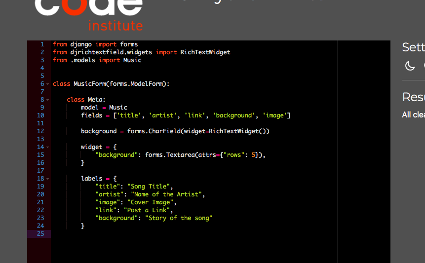

# Music Maker
#### Share your music with other artists and producers

Music Maker is an online platform designed specifically for musicians and producers to share their music with a global audience. With Music Maker, you can easily upload your songs and connect with other listeners and musicians from around the world. Whether you're looking to showcase your talents or simply share your passion for music, Music Maker offers a unique platform to help you reach out. 

## Features

- Register a account for the site to login and logout
- Upload your song with a link, provide a coverimage and a story about your work
- Edit and update your song 
- Delete your song
- Listen to other peoples songs 

##models
I have created one model for this project. It is called Music and looks like this
|  |  | 
| ------ | ------ |
| user  | ForeignKey
| title | CharField
| artist | CharField |
| link | CharField |
| status  | IntegerField |
| background | RichTextField |
| created_on | DateTimeField |
| image | ResizedImagedField |

  
Model of my model

  

## User Stories

Here are the user stories I created in the beginning of the project. I have used the moscow method to prioritize what to do first and to know what can be implemented in the future. 

| Userstories | Moscow | Test |
| ------ | ------ | ------ |
| As a site user, I can register an account so that I can upload my content | Must Have | Yes 
| As a site user, I can upload a link to a song so that I can share it to other users| Must Have| Yes
| As a Site User I can edit my song so that I can manage my content| Must Have | Yes
| As a Site User I can view a list of songs so that I can select one to listen to | Must Have | Yes
| As a Site User I can click on a song so that I can listen to that song | Must Have | Yes
| As a siteuser, I can comment on songs so that I can provide the artist with my feedback | Should Have |
| As a Site User / Admin I can view feedback on an individual song so that I can read the feedback | Should Have |
| As a Site User I can like or unlike a song so that I can interact with the content| Could Have |
|As a Site User / Admin I can view feedback on an individual song so that I can read the feedback| Could Have |
|As a Site User, I can see what genre the song are so that I know which type of music I will listen to| Wont Have |
|As a Site admin, I can provide a genre to my song so that the users know what type of music I do| Wont Have |

## Crud - Testing
| Test | Worked | 
| ------ | ------ |
| A user can sign up to the page  | Yes
| A user can login on the page | Yes
| A user can log out of the page | Yes |
|A user can see another users song on the page | Yes |
|A user can create a new song on the page | Yes |
|A user can edit their own songs on the page | Yes |
|A user can't edit another users songs on the page | Yes |
|A user can delete their own songs on the page | Yes |
|A user can't delete another users songs on the page | Yes |

  
sign up

  

  
Log in

  

  
Log out

  

  
Add Song

  
  

  
Edit Song

  
  

  
Delete Song

  
  

  
No edit/delete

  
  

## Tech

I used these libraries, frameworks and databases for this project

- Cloudinary - to store static files
- Dbdiagram  - used for the database schema diagram
- GitHub - was used as a remote repository to store project code
- Django AllAuth  - was used for user authentication
- Pillow  - was used for image processing and validation
- Psycopg2  - was used as a PostgreSQL database adapter for Python  
- PostgreSQL - deployed project uses a PostgreSQL database

## Validation 

> PEP8 Validation Service was used to check the code for PEP8 requirements. 
> All the code passes with no errors or warnings.

  
urls.py

  

  
urls.py

  

  
admin.py

  

  
forms.py

  

  
views.py

  

  
settings.py. One line has too many characters

  

> Css validator was used to check the code for my css. 
> All the code passes with no errors or warnings.

  
Log out

  

> html Validator was used to check the code for html. 
> All the code passes with no errors or warnings except for the the use of jinja templates.

  
Log out

  

## Credits

> Here are some walkthroughs and videos that inspired and helped me with this project.
 - [Django Recipe sharing](https://www.youtube.com/watch?v=LsU79aY79UA&list=PLXuTq6OsqZjbCSfiLNb2f1FOs8viArjWy&index=15)
  - [Django Spotify Clone](https://www.youtube.com/watch?v=DGTvNM7Yyis)
- [I Think Therefore I Blog](https://www.youtube.com/watch?v=HlocBbrss04&t=1s)

> Here for the css and images 
 - [Bootstrap for the css](https://getbootstrap.com)
 - [Canva for the images](https://www.canva.com)
- [Google font for the fonts](https://fonts.google.com/)
- [Font Awesome for the icons](https://fontawesome.com/)
- [For my favicon](https://favicon.io/favicon-converter/)

  

